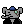

# pixtools

Requires [Imagemagick](http://www.imagemagick.org/)

Some scripts for resizing and processing images since I do this all the time and always forget the incantations...

## grab beastie
To get your transparent beast go to visit this URL with your beast's ID: https://beastopia.com/nobg/<Beast-ID>.png
or

https://beastopia.com/nobg/0565.png

## resize

To resize a background:
```
tools/resize.sh assets/backgrounds/abstract-1.gif
```

to get this


you can edit the size settings in the [resize.sh](tools/resize.sh) script


## composite

to composite one image over the other

 x 


```
tools/composite.sh assets/backgrounds/abstract-1-24x24.gif assets/icons/1322.gif
```

to get this


## Makefile

These two examples are in the [Makefile](Makefile) so you can just type:

```
make resize
make composite
```


to get an output file in `assets/composite.gif`

