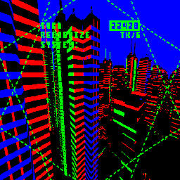
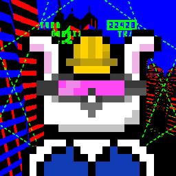
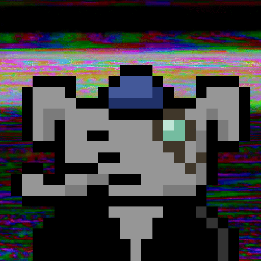

# pixtools for PixelBeasts

Requires [Imagemagick](http://www.imagemagick.org/)

Some scripts for resizing and processing images since I do this all the time and always forget the incantations...

You can use this tool to generate thumbnails, resize images, crop images, and convert images to different formats, and layer images together.


## resize
Grab a background you like or make an animated GIF

To resize a background:
```
tools/resize.sh assets/backgrounds/abstract-1.gif 256x256
```

eg to get this:



you can edit the size settings in the [resize.sh](tools/resize.sh) script


## composite

to composite one image over the other eg:

 x 


```
tools/composite.sh \
    assets/backgrounds/skyline-sq-256x256.gif \
    assets/icons/7564-256x256.gif
```

to get this:




## Makefile
These two examples are in the [Makefile](Makefile) so you can just type:

```
make resize
make composite
```
to get an output file in `assets/composite.gif`

## Example
eg for myself to make a big 512x512 animated gif I did these steps:

```
# resize the background i wanted
tools/resize.sh assets/backgrounds/glitch.gif 512x512

# resize the icon - replace with your own beastie ID
tools/resize.sh assets/icons/1322.png 512x512

# composite the background over the icon
tools/composite.sh assets/backgrounds/glitch-512x512.gif assets/icons/1322-512x512.gif

# rename it
mv assets/composite.gif assets/composites/beastie-1322.gif
```

gives me this file!



## grab beastie
For the pixelbeasts project, I've put all the transparent beasties in the repo but in case you wanted to you can get your transparent beast go to visit this URL with your beast's ID:

`https://beastopia.com/nobg/<Beast-ID>.png`

eg

https://beastopia.com/nobg/1323.png


## Learn more!

For more things you can do with Imagemagick compositing, read the docs!

https://legacy.imagemagick.org/Usage/anim_mods/


## Contribute back!
Please add some cool animations and backgrounds and stuff and add to the repo and [send me a PR!](https://docs.github.com/en/github/collaborating-with-pull-requests/proposing-changes-to-your-work-with-pull-requests/creating-a-pull-request)


